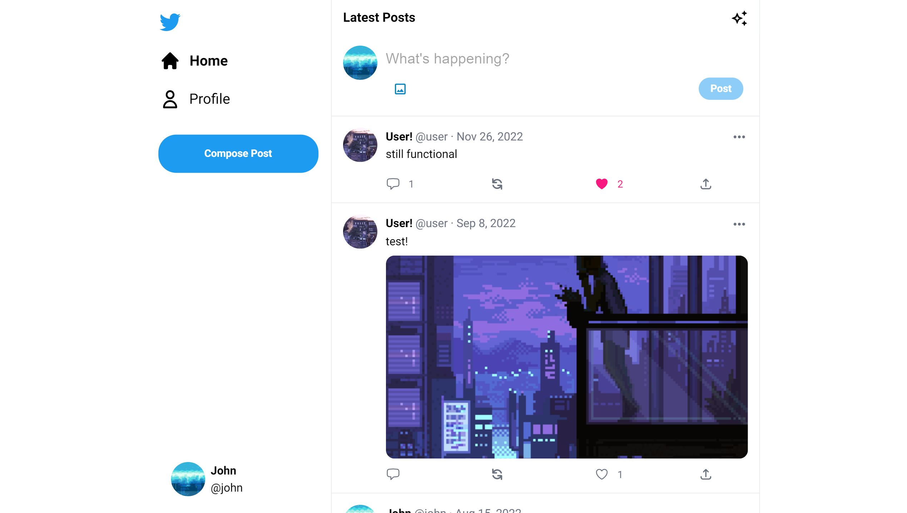
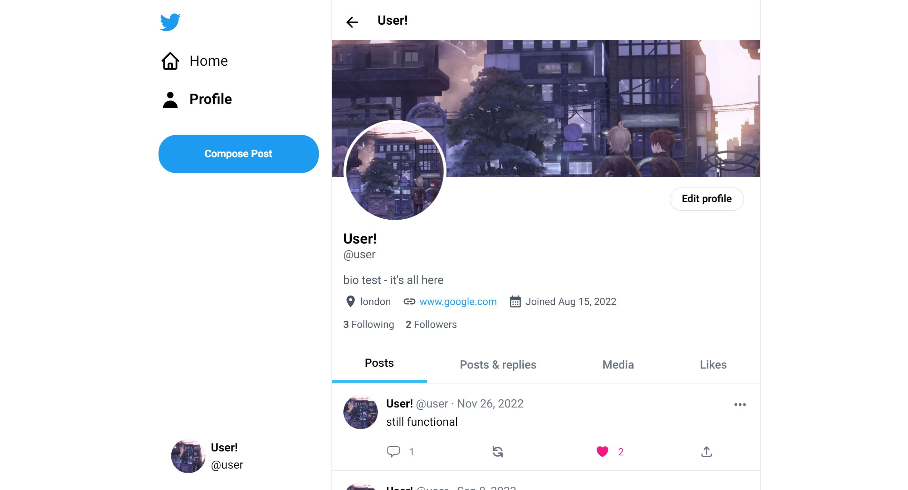
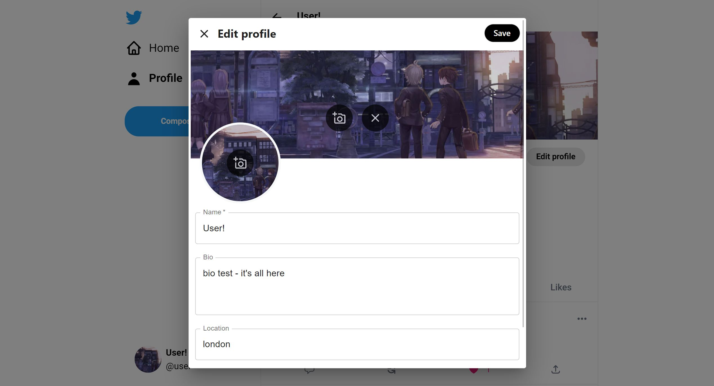
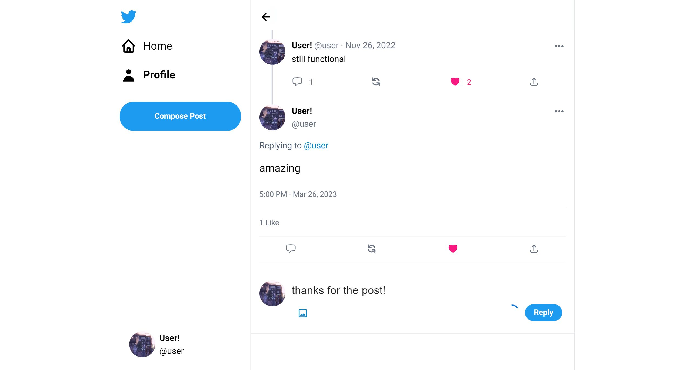
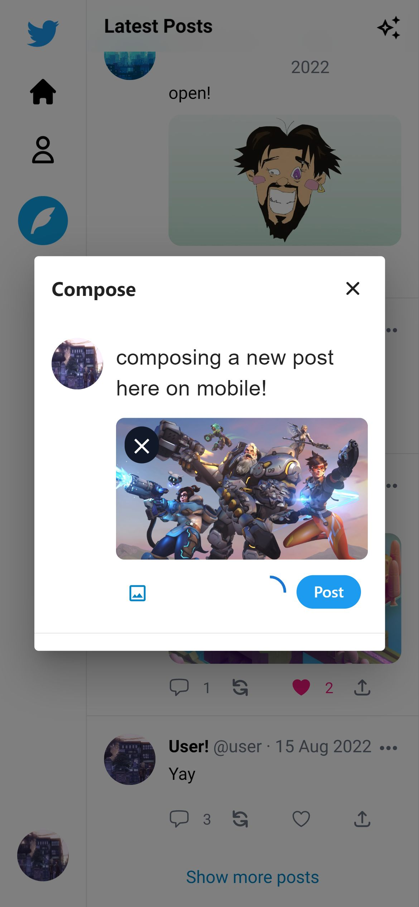

# Chirp

Go to the [live deployed application](https://chirp-flaslam.vercel.app)

(Note that the first launch may take some time because of the server idling)

Go to the [backend repository](https://github.com/flaslam/chirp-backend)

## Technologies used on the frontend

- TypeScript / JavaScript
- React
- Next.js
- Tailwind CSS

## Technologies used on the backend

- TypeScript
- Node.js
- Express.js
- MongoDB
- Passport.js
- Amazon S3 (AWS)

## Running the application locally

First, run the development server:

```bash
npm run dev
# or
yarn dev
```

Open [http://localhost:3000](http://localhost:3000) with your browser to see the result.

Example .env.local file:

```
NEXT_PUBLIC_DB_HOST=http://localhost:5000
NEXT_PUBLIC_FILE_STORAGE_URL=
```

## Screenshots

Timeline (home page):


User profile:


Edit profile:


Reply to main post:


Compose new post (mobile view):

